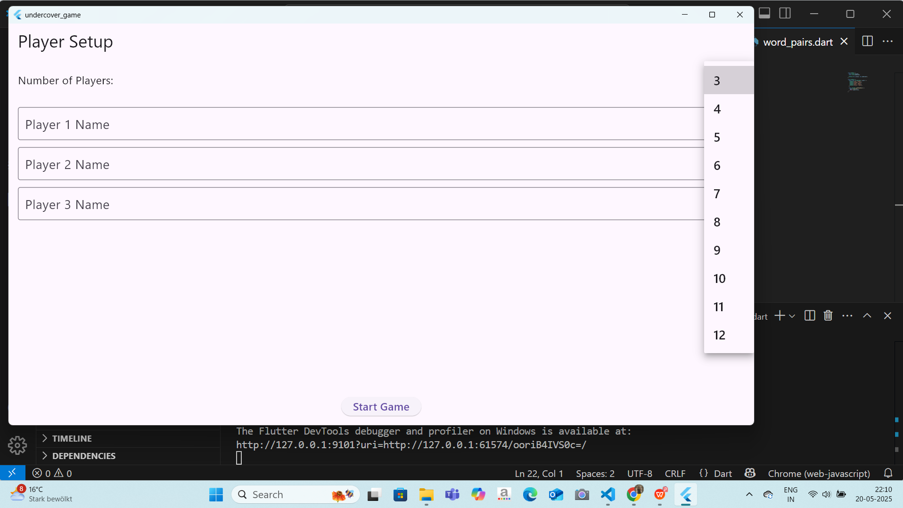
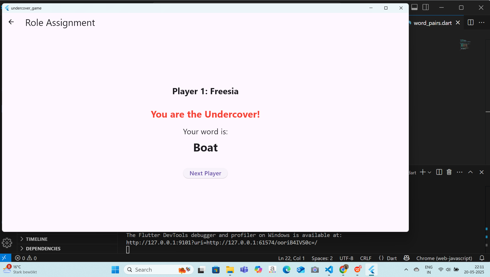
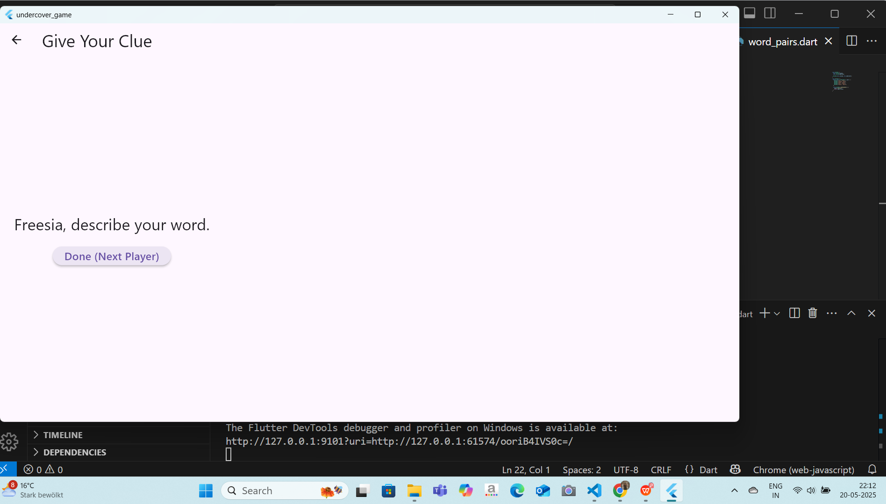
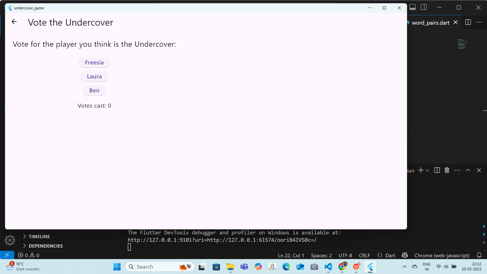
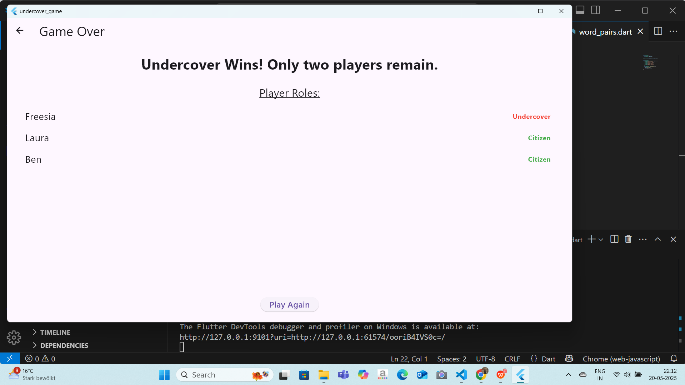

# Undercover Game - Flutter Clone

A fun and simple multiplayer party game inspired by the classic **Undercover** social deduction game. Built entirely in Flutter!

Players are assigned hidden roles and secret words. Citizens try to find the Undercover by sharing clues and voting. The Undercover must blend in by without getting caught!

---

## Features

-  3–12 player setup
-  Unique name entry for each player
-  Secret role and word reveal (Citizen vs Undercover)
-  Turn-based clue giving phase
-  Voting round to eliminate suspects
-  Automatic win condition logic

---

##  Getting Started

All the folders neccessary for the project can be find in lib folder and the folder looks like:

```lib/
├── main.dart              # App entry point
├── models/                # Player model
├── services/              # Game logic and state (GameService)
├── screens/               # UI: Setup, Role, Clue+Vote, Result
├── utils/                 # Word pair generator
└── screenshots            # screenshots of each page
```
###  Prerequisites

- Flutter SDK (3.x preferred)
- Android Studio or VS Code (optional)

###  Run the App

Clone the repo and run:

```bash
flutter pub get
flutter run
```
## Screenshots







